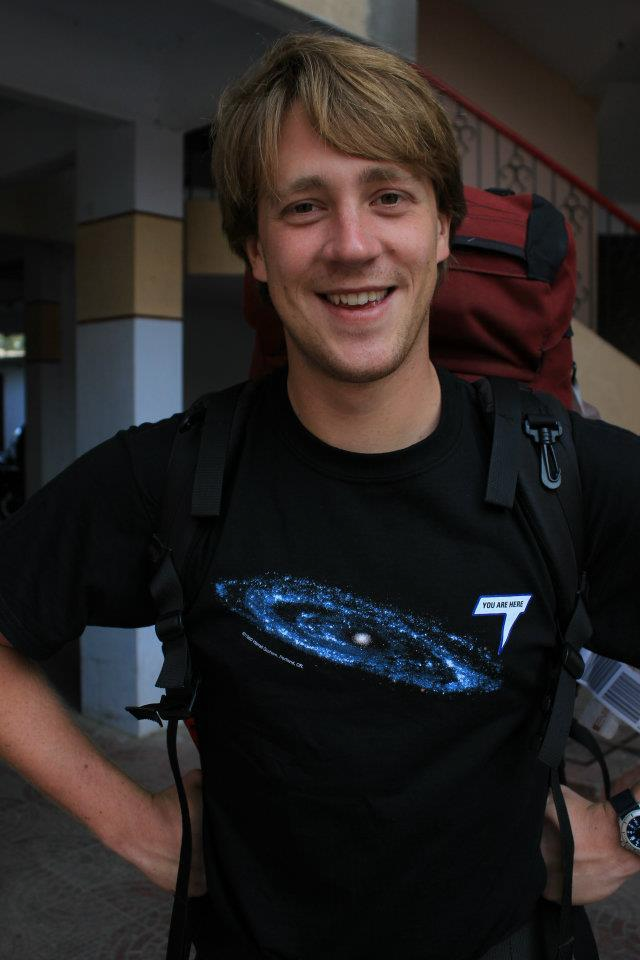

# Kieran Leschinski

email: kieran.leschinski AT univie.ac.at

github: gastronomyk

## Affiliation

University of Vienna, Department of Astrophysics

MICADO Consortium

## Education

### Overview

- 2011 Bachelor of Science (Physics, Astronomy)
- 2014 Master of Science (Astronomy)
- Current PhD Candidate (Astronomy)

### Details

- 2005 - 2011: Monash University, Melbourne, Australia 
    - Bachelor of Science (Physics, Astronomy)
    - Bachelor of Engineering (Civil, incomplete)
    - University of Vienna, Department of Astronomy (2009 Exchange Student)
    - Australian Astronomical Observatory (Summer Project)

- 2012 - 2014: University of Vienna, Austria
    - Master of Science (Astronomy)
    
      For my Master's thesis I investigated the spatial relationship between various species of CO and H2 in the Taurus molecular cloud.

- 2014 - Current: University of Vienna, Austria
    PhD Candidate (Astronomy)

### PhD Topic

During my PhD I have developed a python package ([SimCADO](www.univie.ac.at/simcado)) to simulate raw and cleaned images from the detectors of the MICADO imaging camera for the European Extremely Large Telescope. 
    
On the scientific front I have used the SimCADO package to generate mock observations of star forming regions in both the nearby and early universe, with the goal of defining the limits of what we will be able to realistically achieve with the next generation of imaging facilities.

## Publications worth noting

- Leschinski et al., 2016, "SimCADO - an instrument data simulator package for MICADO at the E-ELT", SPIE, [https://arxiv.org/abs/1609.01480](https://arxiv.org/abs/1609.01480)

- Davies et al., 2016 "MICADO: first light imager for the E-ELT", SPIE, [https://arxiv.org/abs/1607.01954](https://arxiv.org/abs/1607.01954)

## Organisation
- 2017 Mar - Vienna
  Lead organisor for the 2-day SimCADO Hack-athon
  
- 2014 July - Vienna
  LOC - Gaia Visualisation Workshop

## Outreach activities
- 2012 - 2016 
  [The international Astronomical Youth Camp](www.iayc.org)
  as President, General Organiser, and Group leader
  
- 2015 Mar - Vienna
  Sonnenfinsternis, Urania

- 2015 Oct - Vienna
  Lange Nacht der Museen, Urania
  
- 2016 Apr - Vienna
  Lange Nacht der Forschung, Sternwarte
  
- 2016 May - Vienna
  Mercury Tranist, Urania

- 2016 Nov - Vienna
  WAA - Wiener Astronomische Arbeitsgruppe General Versammlung

- 2017 July - Alpbach
  ESA Summer school tutor

--------------------

--------------------

The following is a list, as much for me as for you, just to keep track of everything I've done during my PhD

--------------------

--------------------

## Talks

### Conferences
- 2015 Oct - STEEL, Erice
  SimCADO - An end-to-end instrument data simulator for MICADO on the E-ELT
  
- 2015 Oct - ADASS, Sydney
  Lightning talk on Simcado
  
- 2016 April
  ESO Instrument Simulator workshop
  http://www.eso.org/sci/meetings/2016/simu2016.html
  
- 2017 May
  A* PSF Meeting
  
- 2017 June - Prag
  EWASS ELT session
  Presentation on Simcado and IMF variations

### Uni
- 2015 March - Phd Seminar
- 2015 June - Zeilinger E-ELT Seminar
- 2016 Jan - FOEP
- 2017 Jan - Progress Report
- 2017 May - 2 hour E-ELT seminar

### Teaching
- 2014 May -> June   - Master Instrumentation Tutorial (4x 3hr)
- 2016 April -> June - Bachelor Spectroscopy Tutorial (8x 5hr)
- 2017 April -> June - Bachelor Spectroscopy Tutorial (8x 5hr)

## Writings

### Proceedings

- 2015 Oct - ADASS Sydney
  SimCADO - An end-to-end instrument data simulator for MICADO on the E-ELT
  
- 2016 June - SPIE, Edinburgh
  SimCADO - an instrument data simulator package for MICADO at the E-ELT
  
- 2016 Oct - ADASS, Trieste
  SimCADO - a python package for simulating detector output for MICADO at the E-ELT

### Posters

- 2015 Apr - Oxford
  The MICADO IDS - An Instrument Data Simulator for the E-ELT first-light instrument MICADO

- 2015 June - Garching - EIRO forum
  SimCADO - An Instrument Data Simulator for the E-ELT first-light instrument MICADO

- 2015 Oct - Sydney - ADASS
  Updated: SimCADO - An Instrument Data Simulator for the E-ELT first-light instrument MICADO

- 2016 Apr - Vienna - Lange Nacht der Forschung
  - Das E-ELT: Europas neues Riesenteleskop
  - MICADO: Die Nahinfrarotweitwinkelkamera des europäischen Riesenteleskops

- 2016 June - SPIE, Edinburgh
  SimCADO: A python package to simulate images for the E-ELT's NIR camera: MICADO

- 2016 Oct - ADASS, Trieste
  SimCADO - a python package for simulating detector output for MICADO at the E-ELT

## Conference Attendance

- 2015 Apr - Oxford
  Wetton Workshop - Realising the Astronomy of the Future II - Simulating the Universe
  
  http://astro-conf.physics.ox.ac.uk/wetton15/programme.html
  
- 2015 June - Garching
  EIRO Forum summer school
  
  https://indico.cern.ch/event/368852/
  
- 2015 Oct - Erice
  STEEL summer school
  
  http://www.eso.org/sci/meetings/2015/EELT_EriceSchool2015.html

- 2015 Oct - Sydney
  ADASS 25
  
  http://www.caastro.org/event/2015-adass
  
- 2015 Nov - Sydney
  dot Astronomy 7
  
  http://dotastronomy.com/events/seven/
  
- 2016 Jan - Garching
  MICADO Science Team meeting
  
- 2016 March - Garching
  MICADO Consortium meeting

  - 2016 April - Garching
  ESO Instrument Simulator workshop 
  
  http://www.eso.org/sci/meetings/2016/simu2016.html

- 2016 May - Linz
  A* All-day PSF reconstruction meeting

- 2016 June - Edinburgh
  SPIE - Astronomical Telescopes and Insturmentation
  
  http://spie.org/about-spie/press-room/spie-astronomical-telescopes--instrumentation-2016-news-and-photos

- 2016 July - Dwingeloo
  MICADO Consortium meeting

- 2016 October - Trieste
  ADASS 26
  
  http://www.adass2016.inaf.it/

- 2016 November - Garching
  MICADO Consortium meeting

- 2017 February - Vienna
  Simcado Workshop

- 2017 April - Garching
  MICADO SRR meeting

- 2017 June - Prag
  EWASS
  
- 2017 July - Linz
  MICADO PSF-R and Spectroscopy Meeting
  
