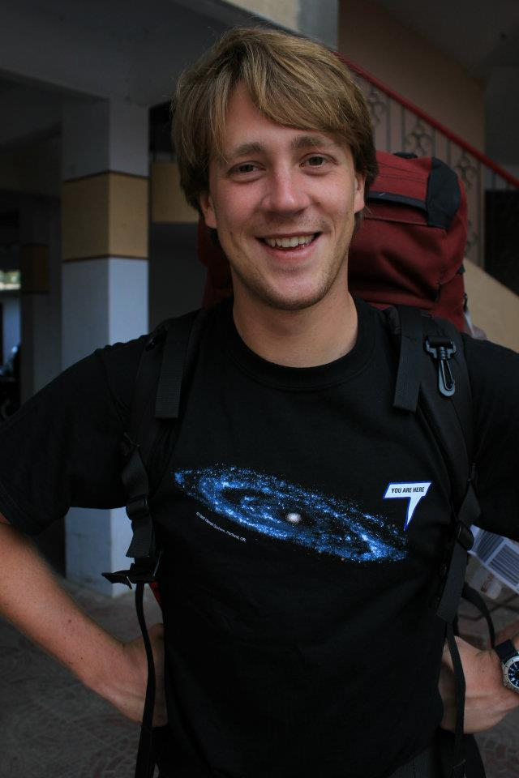

# Kieran's Astronomy Page
-------------------------

I currently work at the University of Vienna, programming an instrument data
simulator for the MICADO camera on the ELT - [SimCADO](www.univie.ac.at/simcado). 

I'm using SimCADO to look at the feasibility of various ELT/MICADO science cases
related to star formation in the early and nearby universe.

[My Curriculum Vitae][CV.md]

Here's where I keep little bits of information and calculations that I've 
already looked up or calcluates thousands of times before.

[NIR Backgrounds](NIR_backgrounds/NIR_bg.md)

